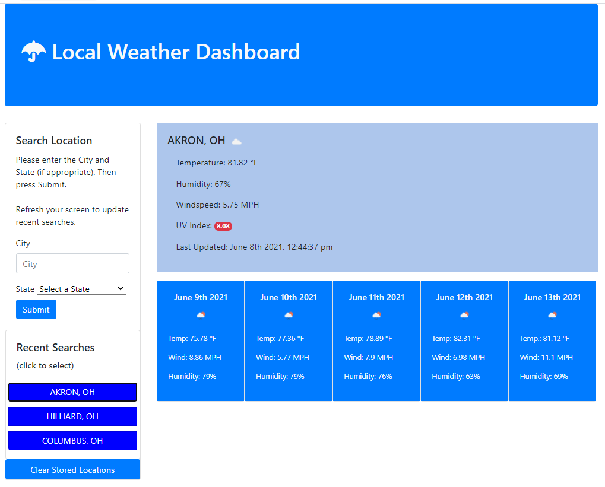

# Roatman_Work_Day_Scheduler

https://rmoatman.github.io/Roatman_Weather_Dashboard/

## Description
~~~
The intent of this project was to build a weather dashboard which allows a user to input a city or city/state to retrieve the current and next 5 days weather forecast.  Locations retrieved are stored in localStorage and easily accessible (by buttons) until cleared by the user.  The data is retrieved using two different third-party APIs.

The user should see an icon that represents the weather for the day.  Also when viewing the UV index, the user should see a color that indicates whether the conditions are favorable, moderate, or severe.  Users will also have a choice to search for a city by inputting the city/state or by clicking on a button representing a previously searched city.

The code runs in the browser and features dynamically updated HTML and CSS.  The project also utilizes Bootstrap and Moment.js.

The core skills demonstrated in this project include:
    - making requests to third-party APIs by using specific parameters to a URL
    - using select API data to populate the weather dashboard using JavaScript
    - performing DOM manipulation to populate and create elements using JavaScript
    - using Bootstrap to assist in styling 
    - using Moment.js to get and update the current date and time
~~~
## Application and Reflection
~~~
This week's coursework and previous projects prepared me for this challenge.  Like previous projects, I broke the steps down and set specific tasks to be completed each day.  First, I familiarized myself with the APIs, their documentation, identified the paths to the data I would need, and set-up my API key.  Next I coded the functionality needed to search for a city (based largely on class activity examples).  Once complete, I created the framework using Bootstrap and worked on populating the current day's forecast.  The 5-day forecast was next.

Creating the search history buttons presented the biggest challenge.  I was stumped.  I pseudo-coded what I wanted to do, but I didn't know how to do it.  I reviewed other projects and was influenced by Mila Decker's code located at https://github.com/deckiedevs/weather-dashboard/blob/main/assets/js/script.js.  Once I reviewed her process to do the same task, it made sense, and I knew how to proceed.  I also had to learn about badges to use as a visual UV indicator.

At one point, I realized that a city could exist in several states.  As a result I addeded a state input box to identify specific cities.   

Once complete, I forwarded the live link to a couple of friends and invited them to "break" my code.  I suggested that they misspell city names, omit states, search for the same city twice, refresh often, clear localStorage often--and then not at all.  What I discovered from theirs and my testing was:  A drop-down box for the states would easily eliminate misspelling of state abbreviations; I needed to create the recent search buttons during the submit event instead of upon refreshing or reloading; and the API database recognizes just a few US Territory cities.

Several areas that I plan to improve upon for my portfolio include: Improving accessability--bootstrap uses a lot of 
 tags; Improving the responsiveness of the page over various screen sizes; and Utilizing additional JavaScript loops to create elements (such as the 5-day forecast cards).
~~~
## Resources and Attributions
~~~
OpenWeather One Call API
https://openweathermap.org/api/one-call-api

Mila Decker's Weather Dashboard
https://github.com/deckiedevs/weather-dashboard/blob/main/assets/js/script.js
~~~

## Contact Information
~~~
- Raemarie Oatman
- raemarie.oatman@gmail.com
- https://www.linkedin.com/in/raemarieoatman
- https://github.com/rmoatman
~~~